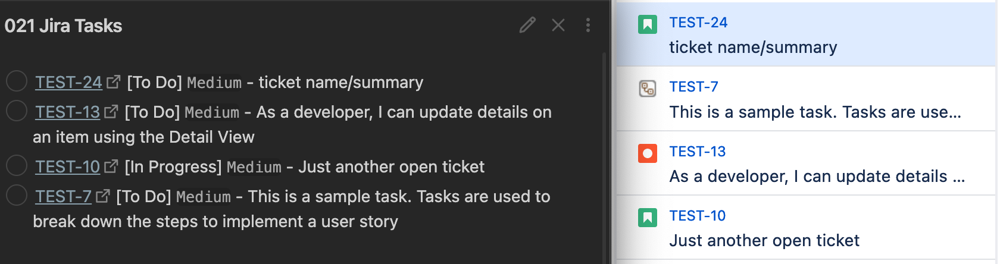

# jira-to-md-todo
Tiny app that synchronizes Jira tickets into a markdown file as to-dos.

- Uses the Jira REST API and the cookie auth login endpoint. 
- Due to this, it will only work with Jira-Server.
- JQL is used to query the tickets.
- The markdown file is overwritten every time.
- There is (currently) no synchronization back to Jira.
